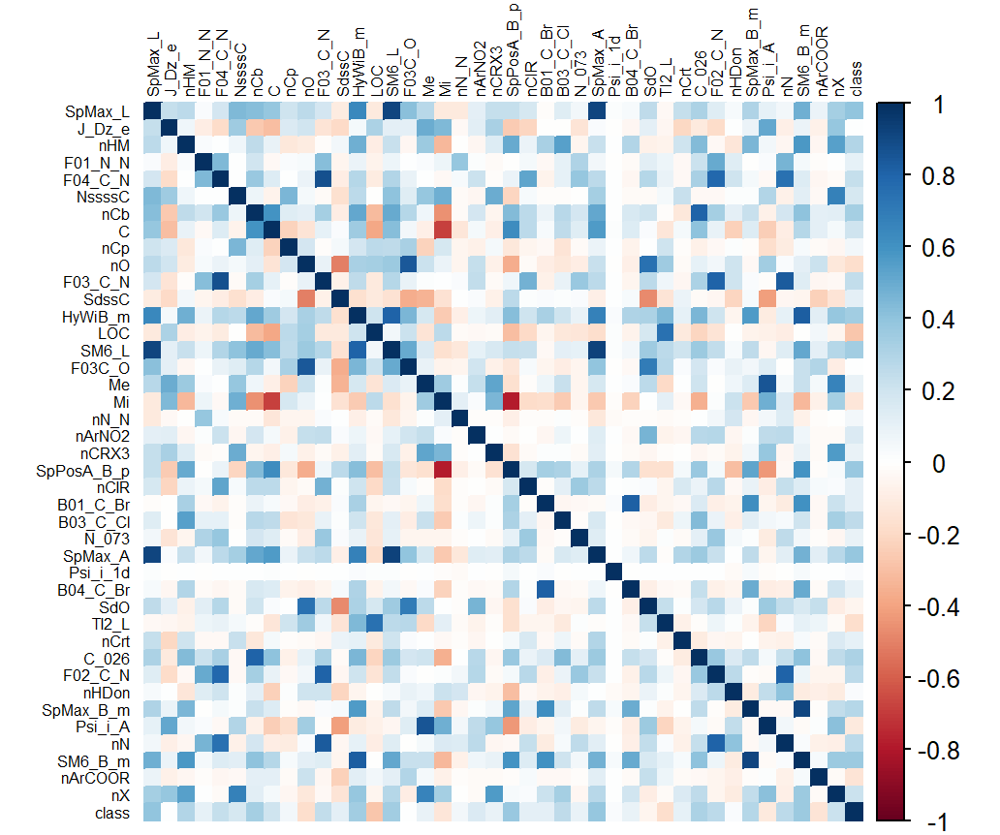

### Overview

Final project of EECS 6690 Statistical learning @ Columbia University.

QSAR (Quantitative Structure-Activity Relationships) is used to predict the biodegradability of chemicals. QSAR biodegradation data set was built to develop QSAR models for studying the relationship between chemical structure and biodegradability of molecules.

### File Structure

```
 📦QSAR
 ┣ 📂data
 ┃ ┗ 📜biodeg.csv        
 ┣ 📂materials
 ┃ ┣ 📂pics                       # pics
 ┃ ┣ 📜6690_Project.pptx              
 ┣ 📜.gitignore
 ┣ 📜6690_proj_algorithm.R        # Reproduce paper method, Adaboost, NN and consensus model
 ┣ 📜QSAR.Rproj
 ┣ 📜tree.Rmd                     # Decision Tree using rpart
 ┣ 📜read_data.Rmd                # Our implementation
 ┗ 📜README.md
```

For Data Set: [Data Set](https://archive.ics.uci.edu/ml/datasets/QSAR+biodegradation)

For Presentation: [Presentation Slides](./materials/6690_Project.pptx)

For result pics: [pictures](./materials/pics)

For our paper: []()

### Data Set Description

- **Number of Instances: 1055** 
  - 356 molecules are ready biodegradable (RB) and 699 are not ready biodegradable (NRB)

- **Number of Attributes: 41** 
  - selected using many classification modeling methods combined with genetic algorithms
- **Correlationships**



### Reproduce

- KNN
- PLSDA
- SVM

### Implementation

- LDA
- Naive Bayes
- Decision Tree
- Bagging
- RandomForest
- Adaboost
- Neural Network
- Concensus Model

### Conclusion

### Citation

Mansouri, K., Ringsted, T., Ballabio, D., Todeschini, R., Consonni, V. (2013). Quantitative Structure - Activity Relationship models for ready biodegradability of chemicals. Journal of Chemical Information and Modeling, 53, 867-878

### Our Team

- [Lei Lyu](https://github.com/ll-l-77)

- [Yi Chen](https://github.com/YiChennee)
- [Wenxiang Zhou](https://github.com/ShionWayne)
- [Yang Yu](https://github.com/peteryoungy)
